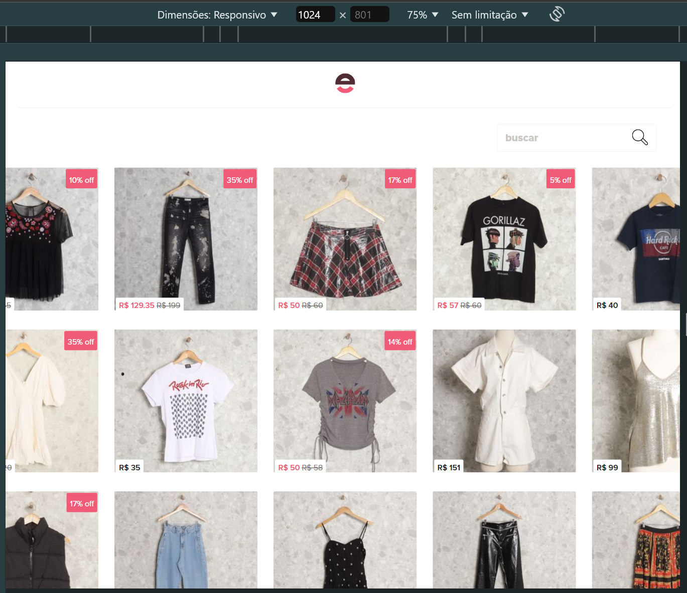
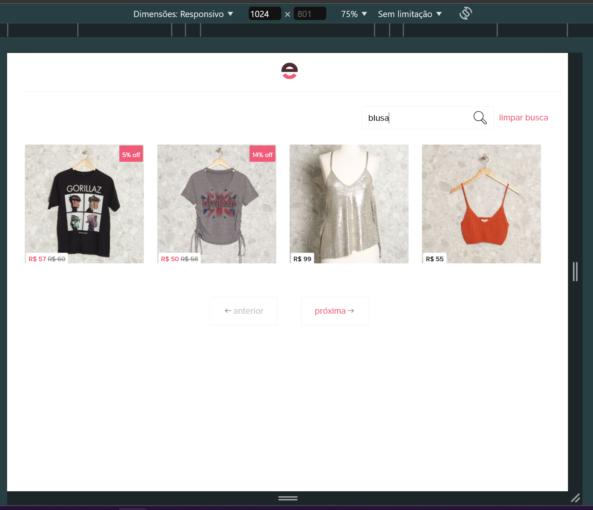
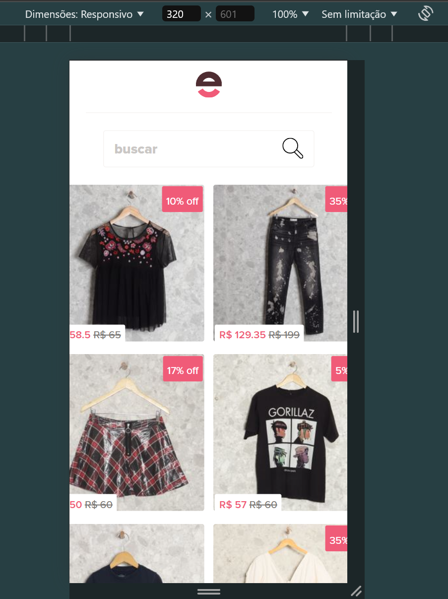

# Teste Front end
**Figma Template**: https://www.figma.com/design/qqGBhbIymYqLqmAPHfHvDt/Teste-Front-End---Product-List-(Copy)?node-id=0-1&t=Uq7CclcYCdhsyveO-0

## Screenshots

### desktop


### search


### mobile


### not found


## Instalando pacotes

```
$ npm install -g yarn
```

## Servidor de desenvolvimento

Instalar dependências do projeto:

```
$ yarn install
```

subir o servidor de desenvolvimento:

```
$ yarn dev
```

acesse `http://localhost:3000/` para ver o projeto.

## Testes automatizados

Rodar os testes:

```
$ yarn test
```

### Lista de testes para realizar

Esses são os testes unitários que identifiquei que seriam importantes de realizar

#### Componentes

- [x] Testar a criação de todos os componentes e páginas
- [ ] **ClearSearch**
  - [x] mockar a propriedade ``transparent``
  - [x] testar se a classe `c-clear__transparent` ta sendo aplicada
  - [ ] testar se o método `clearField` ta limpando o valor do `searchText`
- [x] **Container**
  - [x] testar a aplicação da classe `.gutter`
- [x] **Header**
- [ ] **Loading**
  - [ ] testar se o método `isDesktop` esta sendo chamado no `onBeforeMount`
  - [ ] testar se o `totalItems` esta recebendo valor correto (desktop: 28 - mobile: 6)
- [ ] **Pagination**
  - [ ] mockar propriedade de ``modelValue``
  - [ ] testar se o método ``prev`` esta sendo chamado no click do botão de anterior
  - [ ] testar se o método ``next`` esta sendo chamado no click do botão de próxima
  - [ ] testar se ``page.value`` esta recebendo o valor correto
- [ ] **ProductCard**

  - [ ] mockar as propriedades `{imageId,title,path,price,sale}`
  - [ ] testar se ``getImageUrl`` esta sendo chamado
  - [ ] testar se ``discountCalculator`` esta sendo chamado
  - [ ] testar se ``salePercentage`` esta recebendo o valor correto
  - [ ] testar se ``imageUrl`` esta recebendo o valor correto

- [ ] **SearchBar**
  - [ ] mockar  propriedade de ``modelValue``
  - [ ] testar se ``searchText`` esta recebendo o valor correto
  - [ ] testar se o array de ``products``
  - [ ] testar se o método ``fetchData`` esta sendo chamado
  - [ ] testar se quando ``searchText`` tem valor os produtos são filtrados corretamente

#### Páginas

- [ ] **ProductNotFound**
  - [ ] testa se ``router-link`` esta redirecionando para busca
- [ ] **Search**
  - [ ] mockar propriedades
  - [ ] testa o request da API
  - [ ] testa se esta recebendo ``searchText``
  - [ ] testa se esta recebendo ``pageNumber``
  - [ ] testa se ``loading`` esta escondendo componente

## Estrutura de componentes e páginas

### Componentes

- [x] Navbar
- [x] Card:
  - **Tem**
    - [x] imagem
    - [x] preço
  - **Pode ter**
    - [x] desconto
- [x] Loading
- [x] Pagination
- [x] SearchBar
  - [x] Deve pegar oque o foi digitado
  - [x] Quando começar a digitar mostrar botão outlined de limpar campo
  - [x] Quando digitar filtrar os produtos pelo que foi digitado
  - [x] Mostrar quantos itens foram encontrados
  - [x] Se nenhum item for encontrado redirecionar para pagina de produto não encontrado
  - [x] Quando clickar em limpar busca voltar para home